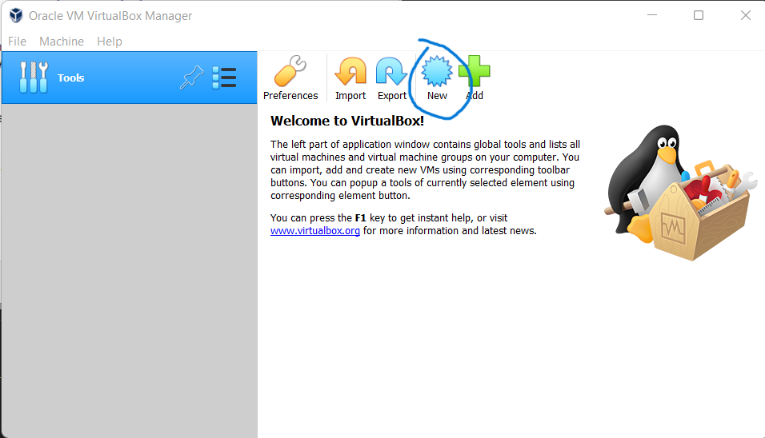

# Welcome to my install Kali linux virtual machine guide
This is a step-by-step guide requiring zero knowledge of virtual machines and installing operating systems.

Quick pre-requisites: 
- Kali OS .iso file
- virtualbox installed(if yes, skip #2)
- at least 60-80 gigabytes of storage space

1. Go to [kali.org/get-kali](https://www.kali.org/get-kali) and download the "Bare Metal" version.
    >kali.org/get-kali/#kali-bare-metal
    >When downloading is done, you should have an ISO file.

2. Go to [virtualbox.org](https://www.svirtualbox.org/) and download the installer.
    >https://www.virtualbox.org/wiki/Downloads
    > - there will be options for Windows hosts, OS X hosts, and linux distributions. Just make sure you are picking the correct one. 
    > - the "hosts" refers to the current operating system you are using.
    >When downloading is done, you should have an installer file. Since I'm currently on windows OS, I have a .exe file.
    >Install the .exe file by clicking on the 

3. On your computer, launch the installed virtual box and it should look like this.

    

4. Since we have an ISO file, click "New" and follow through the steps and screenshots below.

# Under construction. Waiting for budget for extra ssd storage for my laptop. lol.