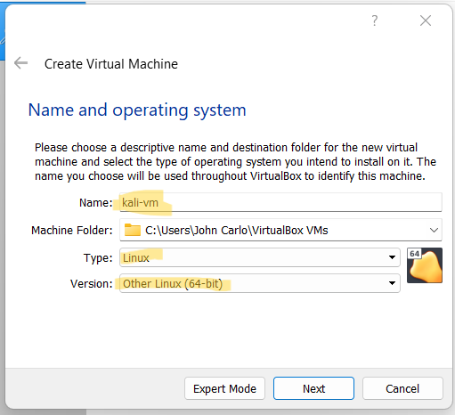
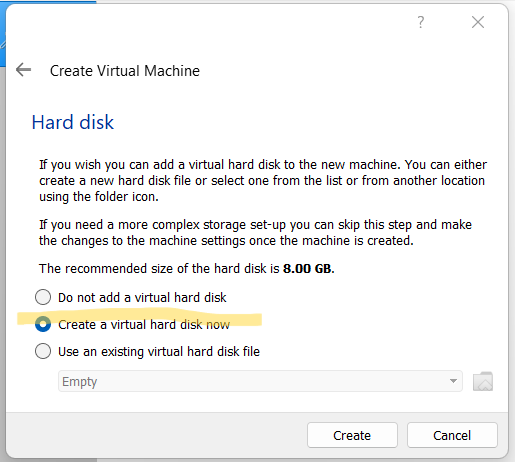
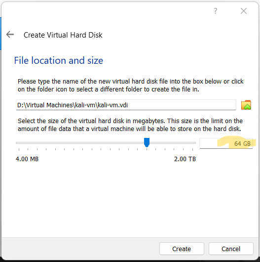
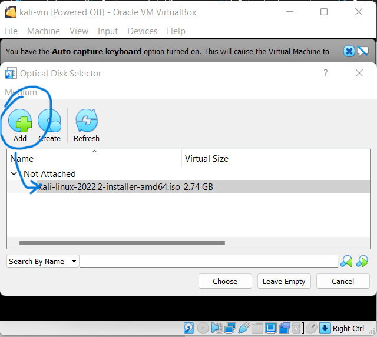
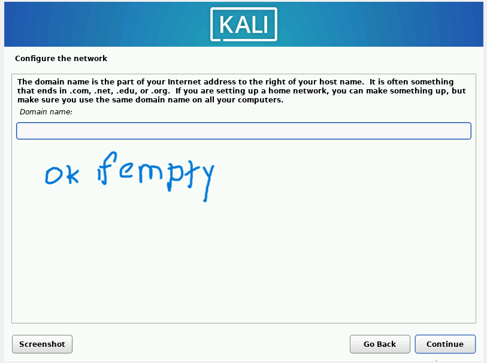
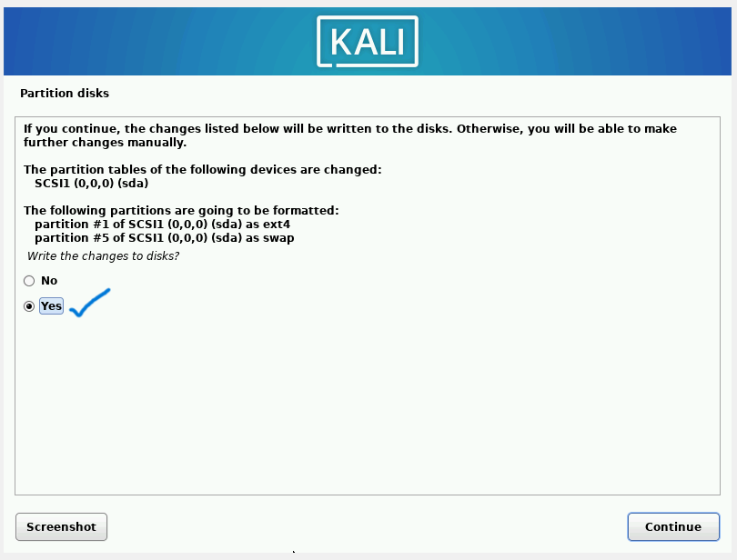
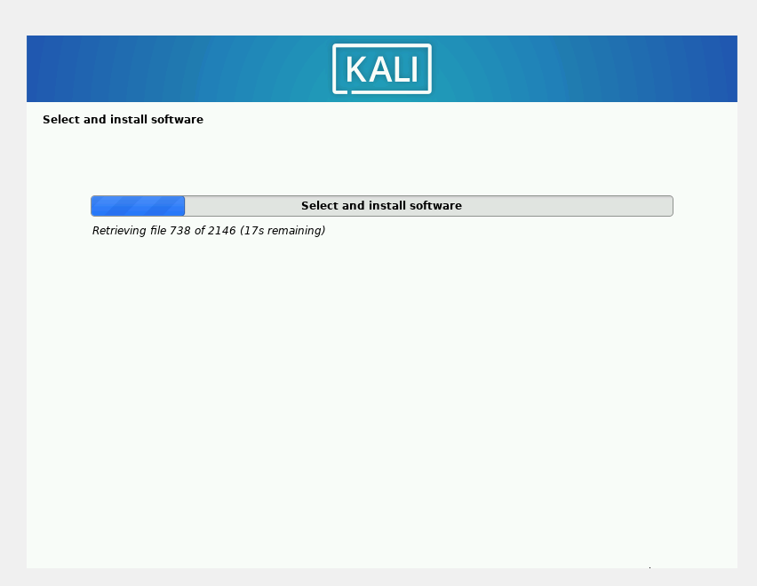
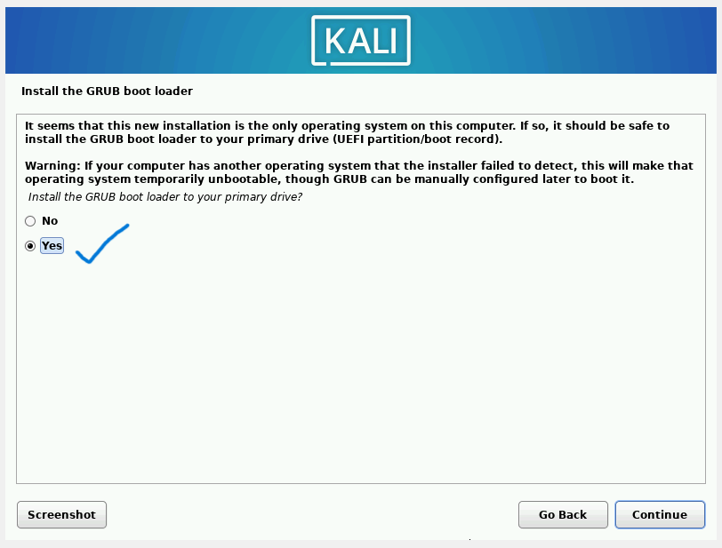
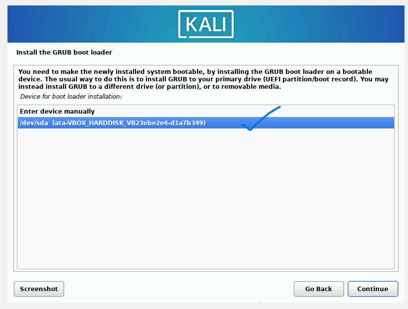

# Welcome to my install Kali linux virtual machine guide
This is a step-by-step guide requiring zero knowledge of virtual machines and installing operating systems.

Quick pre-requisites: 
- Kali OS .iso file
- virtualbox installed(if yes, skip #2)
- at least 60-80 gigabytes of storage space

1. Go to [kali.org/get-kali](https://www.kali.org/get-kali) and download the "Bare Metal" version.
    >kali.org/get-kali/#kali-bare-metal
    >When downloading is done, you should have an ISO file.

2. Go to [virtualbox.org](https://www.svirtualbox.org/) and download the installer.
    >https://www.virtualbox.org/wiki/Downloads
    > - there will be options for Windows hosts, OS X hosts, and linux distributions. Just make sure you are picking the correct one. 
    > - the "hosts" refers to the current operating system you are using.
    >When downloading is done, you should have an installer file. Since I'm currently on windows OS, I have a .exe file.
    >Install the .exe file by clicking on the file and just follow through the standard installation. 

3. On your computer, launch the installed virtual box and click "New".

4. Give it any **Name**. Make sure you follow the **Type** and **Version**. Then click next.

5. Allot RAM for the machine, I recommend giving it half the RAM you currently have. I have 16GB RAM, so I will put 8GB for the VM.

6. From this point on, just follow the series of screenshots below with some notes. Enjoy!

7. You will be asked to reboot. You don't have to do anything but to press the **Continue** button .

8. Some weird texts will come up because of booting things. Don't mind those. Just give it some time like a couple of minutes. If everything went well, the Log In screen below will show. Input your credentials.

9. Congrats! You now have a working Kali Linux OS. Enjoy!

