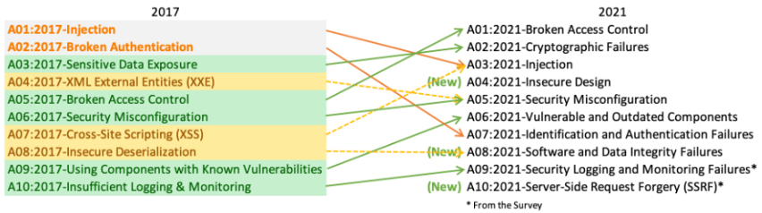

# About OWASP

The Open Web Application Security Project (OWASP) is an open community dedicated to enabling organizations to develop, purchase, and maintain applications and APIs that can be trusted.

Learn more at: [https://www.owasp.org](https://www.owasp.org).

## OWASP V.2017 vs OWASP V.2021

Learn more at: [https://owasp.org/Top10/A00_2021_Introduction/](https://owasp.org/Top10/A00_2021_Introduction/)

## OWASP Top 10 V.2021

1. Broken Access Control

- This is when a user can see things he shouldn't on an app or a website.
- Commonly done via URL modification
- Also known as Privilege escalation.
- Example
    - An attacker simply changes a known URL of a website by adding "admin"
    > https://fac3book.com/app/group/member_details/
    > https://fac3book.com/app/group/admin/member_details
    > - if an unauthenticaed user can access both pages, priviledge escalation will happen.
    > - id a non admin can access the admin page, it is a problem. 

- How to prevent
    - check back-end configs
    - Minimize CORS(cross-origin resource sharing) usage.
    - Apply some record ownership mechanisms rather than a user can create, read, update, or delete any record.
    - Log access control failures and alert admins when repeated failures occur
    - impliment a specified rate access to your APIs to minimize automated attacks via tools
    - study cookies, sessions, tokens, and folow OAuth standards.

2. Cryptographic Failure / Sensitive Data Exposure
- protection of data at rest and in transit is needed
- happens when...
    - data is sent, transmitted, and received in plain text
    - cryptographic algorithms are old or aren't updated
    - use of default cryptographic algorithms and protocols
- how to prevent
    - classify which data are sensitive so that you won't have to encrypt everything
    - Discard quickly sensitive data
    - encrypt all sensitive data at rest
    - ensure up to data algorithms, protocols and keys
    - don't use legacy protocols like FTP and SMTP to transport sensitive data.
    - consider authenticated encryption instead of encryption only.
    - avoid depreciated cryptographic functions like MD5, SHA1, PKCS number 1 v1.5
- Example:
    > An application encrypts credit card numbers in a database using automatic database encryption. However, this data is automatically decrypted when retrieved, allowing a SQL injection flaw to retrieve credit card numbers in clear text.

3. Injection
- happens when...
    - User-supplied data is not validated, filtered, or sanitized by the application.
    - Dynamic queries or non-parameterized calls without context-aware escaping are used directly in the interpreter.
    - Hostile data is used within object-relational mapping (ORM) search parameters to extract additional, sensitive records.
    - Hostile data is directly used or concatenated. The SQL or command contains the structure and malicious data in dynamic queries, commands, or stored procedures.
- can be prevented by...
    - use a safe API
    - user positive server-side input validation
    - Use LIMIT and other SQL Controls within queries to prevent mass disclosure of records in case of SQL injection.

4. Insecure Design

- how to prevent...
    - Establish and use a secure development lifecycle with AppSec professionals to help evaluate and design security and privacy-related controls

    - Establish and use a library of secure design patterns or paved road ready to use components

    - Use threat modeling for critical authentication, access control, business logic, and key flows

    - Integrate security language and controls into user stories

    - Integrate plausibility checks at each tier of your application (from frontend to backend)

    - Write unit and integration tests to validate that all critical flows are resistant to the threat model. Compile use-cases and misuse-cases for each tier of your application.

    - Segregate tier layers on the system and network layers depending on the exposure and protection needs

    - Segregate tenants robustly by design throughout all tiers

    - Limit resource consumption by user or service
- Example
    > A retail chain’s e-commerce website does not have protection against bots run by scalpers buying high-end video cards to resell auction websites. This creates terrible publicity for the video card makers and retail chain owners and enduring bad blood with enthusiasts who cannot obtain these cards at any price. Careful anti-bot design and domain logic rules, such as purchases made within a few seconds of availability, might identify inauthentic purchases and rejected such transactions.

5. Security Misconfiguration

6. Vulnerable and outdated components
7. Identification and authentication failures
8. Software and data integrity failures
9. Security logging and monitoring failures
10. Server-side Request Forgery (SSRF)